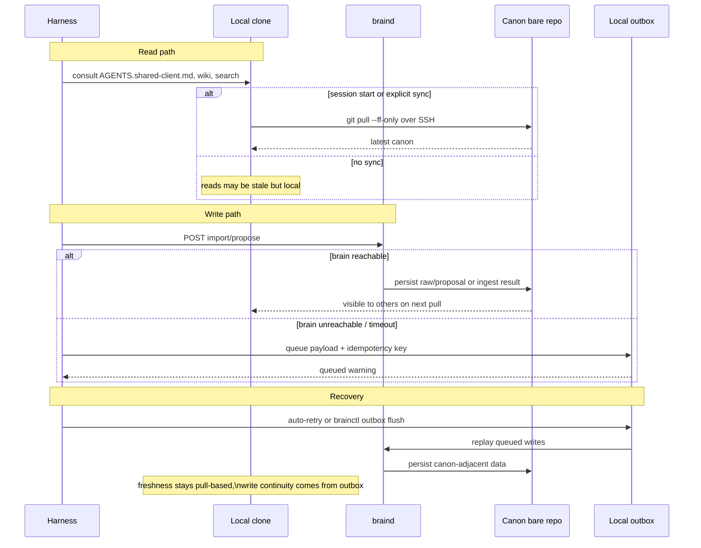
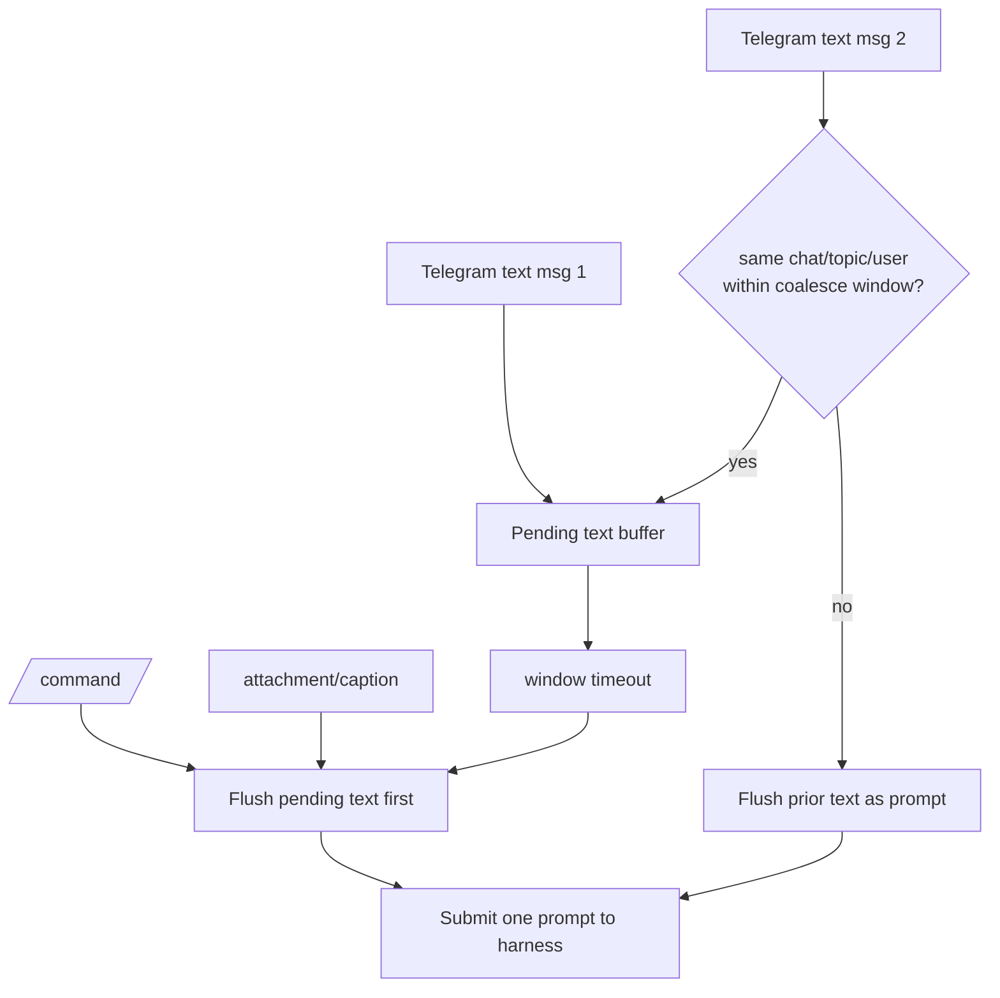
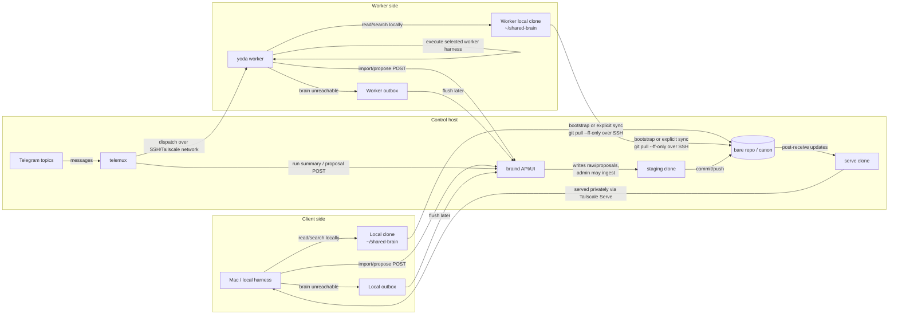

# Brainstack Diagrams

These diagrams show the current customer-zero architecture without adding new services or hidden state.

## Shared-Brain Read, Write, And Outbox Flow

## Telegram Text Coalescing

## Control, Client, Worker Topology

